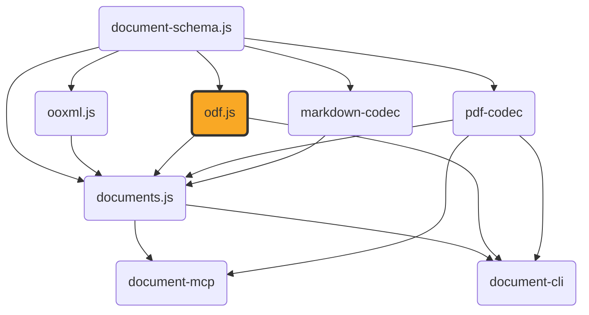

# odf.js

[](https://github.com/ExaDev/odf.js) [](https://www.npmjs.com/package/odf.js) [](https://github.com/ExaDev/odf.js/releases/latest) [](https://github.com/ExaDev/odf.js/actions)

> A hand-written, dependency-minimal codec for the OpenDocument Format (ODF — OASIS/ISO 26300): `.odt`/`.ods`/`.odp`/`.odg`/`.odf`/`.odb`/`.odm` and their template variants, built on [Zod 4](https://zod.dev) codecs.

`odf.js` is the ODF sibling of [`ooxml.js`](https://github.com/ExaDev/ooxml.js), mirroring its architecture as closely as the two, structurally unrelated formats allow: a lossless ZIP-of-XML core that round-trips any package byte-for-content-faithful, with ergonomic typed readers layered on top for convenient access. Unlike OOXML — a ZIP of parts with a relationship-file (`.rels`) mechanism and an extension-defaults-plus-overrides `[Content_Types].xml` — ODF has no relationships at all (inter-part references are direct paths/IRIs) and an exhaustive `META-INF/manifest.xml` that enumerates every part explicitly. Where OOXML runs carry formatting directly as attributes, ODF has no inline/direct formatting whatsoever: every formatting difference, however small, must be a named "automatic style" — so `odf.js` owns a style-interning subsystem (`src/styles/`) with no equivalent anywhere in `ooxml.js`.

**This package does not depend on `ooxml.js`**, even though the two do near-identical jobs for their respective formats: `ooxml.js` is a package signed, SBOM-attested, and branded exclusively around ECMA-376/OOXML, so depending on it here would be a permanently wrong signal for an OASIS-standard codec, and would force a breaking `ooxml.js` release every time an ODF-only fix needed the shared primitive layer. Instead, `odf.js` duplicates the small (~400-line) generic ZIP/XML/`Package` layer as its own code — kept deliberately structurally identical (plain, unmarked shapes, no branding) so TypeScript's structural typing makes the two packages' `Package`/`XmlNode`/`XmlElement` values freely interchangeable wherever a shared consumer (like `documents.js`) needs to treat them uniformly, without either package formally depending on the other.

Both packages **do** depend on [`document-schema.js`](https://github.com/ExaDev/document-schema.js), the genuinely shared canonical schema for `ContentDocument`/`LayoutDocument` — the semantic content model (paragraphs, runs, tables, shapes, slides) both an ODF and an OOXML reader ultimately produce. `odf.js`'s typed readers return the real, imported `ContentSection`/`ContentSlide`/etc. types from that package, not a structurally-similar lookalike, so a downstream consumer (`documents.js`) can run an `.odt` through the exact same layout/pagination engine it already uses for `.docx`, unmodified.



## Status

This package is under active development. What's built and shipped:

- **Lossless core** — generic ZIP-of-XML primitives (`Package`/`XmlNode`/`XmlElement`, XML parse/build, zip/unzip, base64, the `packageCodec`/`xmlCodec` `z.codec()` pairs) with zero ODF-specific knowledge.
- **Namespaces, media types, mimetype, manifest** (`src/ns.ts`, `src/media-type.ts`, `src/mimetype.ts`, `src/manifest.ts`) — full read *and* write, including `META-INF/manifest.xml`'s exhaustive per-part enumeration and the mimetype part's mandatory first-entry/stored/uncompressed byte layout, verified against real LibreOffice-produced output.
- **Style interning** (`src/styles/`) — `StyleRegistry`: adopts a part's existing automatic styles on construction, finds-or-mints on `intern()`, fingerprints on canonical serialized properties plus parent style name (never `JSON.stringify`), and is collision-checked across all four style containers a document can have.
- **Shared typed primitives** (`src/typed/shared/`) — ODF length-unit parsing (`cm`/`mm`/`in`/`pt`/`pc`/`px`), A1-style spreadsheet cell-reference computation with repeat-count cursor advancement, colour/geometry/master-page-size parsing into `document-schema.js`'s own types, ODF's `text:s`/`text:tab`/`text:line-break` whitespace-run decoding, the read-side style cascade (`style:default-style` → parent chain → the referenced style — one layer shorter than OOXML's, since ODF has no separate direct-formatting layer on top), the shared `text:p` → `ContentParagraph`/`ContentRun` and `table:table` → `ContentTable` readers (`readOdfParagraph`/`readOdfTable`) every typed reader below builds on, the `draw:transform`/`draw:g` group-flattening geometry resolver, an `svg:d`/`draw:points` vector-path grammar parser, and `meta.xml` reading.
- **Typed readers** — `readOdt` (wordprocessing), `readOdp` (presentation slides: `draw:frame`/`draw:g` text/image/table content), `readOdg` (drawing pages: every vector primitive — `draw:rect`/`draw:ellipse`/`draw:circle`/`draw:line`/`draw:path`/`draw:polygon`/`draw:polyline`, plus a recognised `draw:custom-shape` preset subset — in real `draw:z-index`-aware paint order), and `readOds` (spreadsheets: geometry- and print-settings-rich, every `office:value-type` variant with its own OpenFormula string, plus cell- and page-anchored `draw:frame` images and embedded ODF sub-documents) each resolve a `Package` into `document-schema.js`'s own `ContentSection`/`ContentSlide`/`ContentDrawPage`/`ContentSheet` shapes.
- **`readOdfFormula`** resolves a standalone or embedded `.odf` formula's `content.xml` — bare MathML with no `office:document-content` wrapper, confirmed against real LibreOffice output — into its raw MathML nodes plus, when present, the formula's own native StarMath annotation string, in this reader's own bespoke `OdfFormulaDocument` shape. **`readOdfFormulaDocument`** wraps that same result into a real `document-schema.js` `ContentDocument` of kind `'formula'` — `document-schema.js` 2.0.0 added a `MathMlNode`/`ContentFormula` pivot shape for exactly this, a structural mirror of this package's own `XmlNode` that `readOdfFormula`'s real output assigns to with zero cast.
- **`readOdm`** resolves a `.odm` master document's own `content.xml` into an ordered list of chapter references (`{ name, href, filterName? }`, one per top-level linked `text:section`) without opening the external `.odt` files those references point at. A master document's chapters are genuinely external files by ODF design, not embedded package sub-documents — confirmed against real LibreOffice output, which never caches a chapter's own content inside the master document itself (see `src/typed/odm/read.ts`'s own top-of-file note).
- **`readOdbInventory`** resolves a `.odb` database front-end package into connection info, its table *names*, its query *definitions* (name, real `db:command` SQL text, and `db:escape-processing` when declared), and its forms/reports as `{ name, href }` pairs. Confirmed against real LibreOffice output that `office:database` lives directly in the package's ordinary `content.xml` (no separate `database/connection.xml` part, contrary to the OASIS schema's own chapter layout suggesting one), that queries are declared inline (`db:queries/db:query`, no manifest part of their own), and that a live engine's own tables have no ODF-level manifest listing at all. A form's/report's sub-document directory is named after an opaque *persistent* name (`forms/Obj11`), **not** after the form/report — the user-visible name lives only in `content.xml`'s own `db:forms`/`db:reports` registry, which is where this reader takes both the name and the href from. See `src/typed/odb/read.ts`'s own top-of-file note for the full findings.
- **`readOdbForm`** and **`readOdbReport`** open one of those sub-documents and extract its *static structure*, executing nothing. A form sub-document is a complete, ordinary ODF text document (`readOdt` reads it unmodified through `subDocumentPackage`, a synthetic sub-`Package` view over the sub-document's own directory) plus an `office:text/office:forms` control tree: per form, its `form:command`/`form:command-type` binding, every control's real element tag, UNO control implementation and `form:data-field` binding, and any genuinely nested sub-form with its own independent binding. A report sub-document uses the `rpt:` Report Builder vocabulary: the `rpt:command`/`rpt:command-type` data binding, the band stack (report header, page header, detail, page footer, report footer), the recursive group tree with each group's own expression/sort/page-break attributes and header/footer bands, every band's bound fields (`field:[COLUMN]`, unwrapped into a real column name) and computed expressions (`rpt:SUM([AMOUNT])`, left verbatim), and the report's own `rpt:function` declarations. Both are grounded in a real, LibreOffice-generated fixture rather than in the schema — which is what caught the two shapes an assumed reading gets wrong: the detail band is nested *inside the innermost group*, not a sibling of the other bands, and a group's key is a formula (`rpt:HASCHANGED("REGION")`), not a bare column name. See `src/typed/odb/form.ts`'s and `src/typed/odb/report.ts`'s own top-of-file notes.

Not yet built: live-view editors and the `.odb` database-table-export subsystem. This section will be replaced with real usage examples once those land — see the [Architecture](#architecture) section below for the intended shape, and this repository's own commit history/releases for current progress.

A general-purpose SQL query engine for actually rendering a Report against its data — as opposed to reading the report's own static `rpt:command`/band/group definition, which `readOdbReport` already does — has been deliberately **not attempted**, not merely left unstarted. `readOdbInventory` already extracts a query's or report's real `db:command`/`rpt:command` SQL text verbatim, and a rough survey against the one real fixture this package has (`src/typed/odb/fixtures/form-and-report.odb`) suggests the underlying query text itself would often fall inside a plausible bounded SQL subset (single-table `SELECT`/`WHERE`/`ORDER BY`, no `JOIN`s or subqueries) — but that survey is a sample size of one report and should not be read as a real coverage figure. Building even a bounded engine against it means reimplementing a slice of HSQLDB's/Firebird's own query semantics, which is a materially different undertaking from decoding their file formats (already done safely elsewhere in this package's `.odb` support) and raises its own licensing questions that have not yet been reviewed. This is gated on the requesting engineer's own explicit sign-off on that licensing posture, given after reading the relevant engine source — not given yet — before any such engine is built.

## Getting started

Requires Node.js `>=20` and pnpm `11.6.0` (pinned via `packageManager` in `package.json`).

```sh
pnpm install
```

Install as a dependency in another project:

```sh
pnpm add odf.js
# or
npm install odf.js
```

## Usage

The lossless core — the only public surface stable enough to document with real examples right now:

```ts
import { decodePackage, encodePackage } from 'odf.js';

// .odt / .ods / .odp bytes -> faithful JSON Package
const pkg = decodePackage(new Uint8Array(await file.arrayBuffer()));

// ...inspect pkg.parts...

// Package -> bytes (content-identical, mimetype-first/stored, manifest untouched)
const bytes = encodePackage(pkg);
```

Manifest and mimetype, ODF's own package-identity mechanism (no relationships, unlike OOXML):

```ts
import { readManifest, syncManifest, setDocumentMediaType, readMimetype } from 'odf.js';

const manifest = readManifest(pkg); // { entries: [{ fullPath, mediaType }, ...] }
setDocumentMediaType(pkg, 'application/vnd.oasis.opendocument.text'); // updates mimetype + manifest root entry atomically
syncManifest(pkg); // rebuilds manifest.xml to exactly match pkg's current parts
readMimetype(pkg); // 'application/vnd.oasis.opendocument.text'
```

Every module is also importable directly by its own subpath, without going through the barrel — useful for a caller that wants one narrow piece of the package (e.g. a bundler doing tree-shaking, or a script that only needs the length-unit parser) without pulling in the rest:

```ts
import { parseOdfLength } from 'odf.js/typed/shared/units';

parseOdfLength('2.5cm'); // 70.86614173228347
```

Any `src/**/*.ts` module (excluding tests and internal `test-support/` fixtures) resolves this way, at its path relative to `src/` — `src/manifest.ts` as `odf.js/manifest`, `src/typed/odt/read.ts` as `odf.js/typed/odt/read`, and so on.

## Architecture

Layered from a lossless core outward, mirroring `ooxml.js`'s own structure:

- **`src/model/`** — `Package`/`XmlNode`/`XmlElement` and friends: a duplicate-by-design copy of `ooxml.js`'s equivalent, kept structurally identical (see [Why no `ooxml.js` dependency](#why-no-ooxmljs-dependency) above).
- **`src/xml/`** — `parse.ts`/`build.ts` (XML string ⇄ `XmlNode[]` forest via `fast-xml-parser`), `fragment.ts`/`entities.ts` (production element/text-node construction and entity encoding — `odf.js` writes `manifest.xml` itself, unlike `ooxml.js`'s read-only stance on OPC relationships, so this needs to be real writing code, not test-only scaffolding), `query.ts` (shared tree-query helpers).
- **`src/image/`** — `sniffImageFormat` (`ImageFormat`): a minimal PNG/JPEG magic-byte format sniffer with no ODF knowledge of its own, consumed by `src/manifest.ts` (choosing a binary part's manifest media type) and `src/typed/draw/shapes.ts` (resolving a `draw:image`'s own `ContentImageBlock.format`).
- **`src/zip.ts`** — takes *ordered* `[path, entry]` tuples, not a `Record`, specifically so ODF's mimetype-first/stored/uncompressed requirement doesn't depend on `Record`/`Object.keys` insertion order surviving a Zod round trip.
- **`src/package-io/`** — `write.ts` hoists a `mimetype` part first (stored) and `META-INF/manifest.xml` second, if present, before everything else in existing order — the one deliberate behavioural difference from `ooxml.js`'s own writer, and never fabricates either part as a side effect.
- **`src/manifest.ts`** — unlike `ooxml.js` (which only ever *reads* OPC relationships, leaving writing to `documents.js`), `odf.js` owns manifest read **and** write, since the manifest is ODF's one mandatory part and its correctness is exhaustive.
- **`src/styles/`** — `properties.ts` (the property-bag shape + real ODF attribute parsing), `serialize.ts` (canonical, deterministic property-bag → XML attributes), `registry.ts` (`StyleRegistry`, ODF's mandatory style-interning layer, no OOXML equivalent), `span.ts` (character-range wrapping into a formattable `text:span`, correctly splitting `text:s`/`text:tab` elements that straddle a boundary).
- **`src/typed/shared/`** — the ODF-specific typed primitives every future format reader builds on: `units.ts`, `a1.ts`, `color.ts`/`geometry.ts` (parsing into `document-schema.js`'s own types, never redefining them), `style.ts` (a thin re-export — ODF's style-properties concern is fully covered by `styles/properties.ts` and the cascade below), `text.ts` (whitespace-run decoding), `cascade.ts` (the read-side style-resolution walk), `paragraph.ts`/`table.ts` (`readOdfParagraph`/`readOdfTable`, the shared `text:p` → `ContentParagraph`/`ContentRun` and `table:table` → `ContentTable` readers `readOdt`, `readOds`, and `typed/draw/shapes.ts` all call), `transform.ts` (the `draw:transform`/`draw:g` group-flattening geometry resolver), `masterpage.ts` (master-page → page-layout page-size/print-settings resolution, shared by a `draw:page`'s own size and a spreadsheet's print settings), `path.ts` (an `svg:d`/`draw:points` vector-path grammar parser), `metadata.ts` (`meta.xml` reading).
- **`src/typed/odt/`, `src/typed/odp/`, `src/typed/odg/`, `src/typed/ods/`** — the built `readOdt`/`readOdp`/`readOdg`/`readOds` readers; **`src/typed/draw/`** — the `draw:frame`/`draw:g`/vector-primitive shape vocabulary `readOdp` and `readOdg` both share (`shapes.ts`), plus `embedded.ts`'s `readDrawObjectReference`, the `draw:object` embedded-sub-document counterpart `readOds` resolves a sheet's anchored OLE objects through, and `shapes.ts`'s own `readDrawImageBlock` (a `draw:image` plus its containing `draw:frame` and a resolved `Box` → `ContentImageBlock`) — already used internally by `readDrawFrameContent`, and exported in its own right so a sibling package (`documents.js`) can resolve a frame's image content directly rather than only through a full `readOdp`/`readOdg`/`readOds` call; **`src/typed/formula/`, `src/typed/odm/`** — `readOdfFormula`/`readOdfFormulaDocument` (raw MathML, and the `document-schema.js` `ContentDocument` 'formula'-kind pivot built on top of it) and `readOdm` (a `.odm` master document's own external chapter references — name/href/filter-name per linked `text:section`, never the linked content itself); **`src/typed/odb/`** — `readOdbInventory` (a `.odb` package's own connection info, table/query/form/report registry, never the database engine's own storage), plus `readOdbForm`/`readOdbReport` (static, execution-free structure extraction from a form's or report's own ODF sub-document), `resolveOdbComponent` (the shared `db:forms`/`db:reports` name → `OdbComponentInfo` lookup both readers are built on, also exported for a caller that wants a component's href without opening its sub-document), and `subDocumentPackage` (the synthetic sub-`Package` view they read those sub-documents through).

## Why no `ooxml.js` dependency

See the top of this README — the short version: `ooxml.js`'s branding and signed SBOM make it the wrong dependency for an OASIS-standard package regardless of how much low-level code the two could share; `document-schema.js` is the neutral package both actually depend on for the parts that are genuinely, permanently identical (the semantic content vocabulary), while the ZIP-of-XML primitive layer stays duplicated on purpose.

## Conventions

- **Zod-first schema/type/guard**, matching `ooxml.js`/`document-schema.js`: every model type is inferred from its Zod schema, never hand-written.
- **Recursive types use a hand-written structural guard, not `z.lazy`** — the same `z.lazy`-collapses-to-`unknown` issue `ooxml.js`'s `XmlNode` and `document-schema.js`'s `ContentBlock` already work around.
- **No type assertions anywhere** — `assertionStyle: 'never'`, `noInlineConfig: true`, matching both sibling packages exactly.
- **Ground truth over memory for every ODF spec fact.** Namespace URIs, media types, style-property attribute names, and `meta.xml` element names are all verified against either the live OASIS ODF specification or real files produced by an installed LibreOffice, never assumed from pattern-matching an OOXML analogue or a remembered convention — several confirmed traps exist specifically because the "obvious" guess is wrong (see [Gotchas](#gotchas-and-quirks)).

## Gotchas and quirks

- **Several ODF namespace URIs are not what you'd guess from the prefix.** `draw:` is `...xmlns:drawing:1.0`, not `...draw:1.0`; `number:` is `...xmlns:datastyle:1.0`, not `...number:1.0`; `fo:`/`svg:`/`smil:` are OASIS's own `*-compatible:1.0` URIs, not the real W3C namespaces those prefixes suggest. See `src/ns.ts`'s inline comments for the full, verified table.
- **`.odb`'s real media type is `application/vnd.oasis.opendocument.base`**, not `...database` — a common stale/wrong value found in some third-party documentation.
- **ODF's `dc:creator` is not "the author."** It records whoever most recently *saved* the document (Dublin Core's own definition); the original author is `meta:initial-creator`. `typed/shared/metadata.ts` maps `LayoutMetadata.author` to `meta:initial-creator`, matching the byline role `ooxml.js`'s own `DocumentMetadata.author` plays for OOXML.
- **`meta:keyword` appears once per keyword**, unlike OOXML's single comma-separated `cp:keywords` element.
- **`table:number-columns-repeated`/`table:number-rows-repeated` must be cursor-advanced, never materialized.** A real spreadsheet has trailing cells/rows with repeat counts over a million; `typed/shared/a1.ts`'s cursor advances in O(1) without allocating that many objects — tested against a real repeat count taken from a genuine LibreOffice template.
- **ODF cells carry no explicit cell-reference attribute at all** (unlike xlsx's `r="B7"`) — `typed/shared/a1.ts` computes A1-style references from a running column/row cursor as a reader walks cells in document order.
- **A rotated `draw:rect`/`draw:ellipse`/`draw:path`/`draw:custom-shape` vector primitive now reads its own `rotationDeg`, not just its unrotated bounding frame.** `resolveVectorGeometry` (`typed/draw/shapes.ts`) replaces the old frame-only `resolveVectorFrame`, reusing the exact same `resolveOdfShapeGeometry`/`composeOdfGroupTransform` machinery `draw:frame` already resolved rotation through, including composing an enclosing `draw:g`'s own rotation the same way it already did for a frame. `ContentVectorSchema`'s rect/ellipse/path variants already carried a `rotationDeg` field before this change — it was being discarded on the read side, not missing from the schema.
- **Every `ContentShape`/`ContentVector` a drawing or presentation reader produces is now stamped with its own resolved `paintOrder`, not merely sorted by it and discarded.** `walkDrawPageContent` (odg) and `walkDrawShapes` (odp) both compute a real z-index per element — an explicit `draw:z-index` when present, otherwise a monotonic document-encounter counter — purely to order their own output arrays; that value is now attached to each produced value via the same single counter threaded across the whole walk. Because `shapes` and `vectors` are stamped from the identical counter, a caller can recover their true relative paint order across the two independently-ordered arrays by comparing `paintOrder` directly — closing the cross-array ordering gap `documents.js`'s own README previously described as unrecoverable, even though `ContentDrawPageSchema` itself still keeps the two arrays with no shared ordering field of its own.
- **`svg:fill-rule` (`nonzero`/`evenodd`) and `draw:stroke`'s `solid`/`dash` enumeration are now read and mapped onto `ContentVector`'s path-variant `fillRule` and `ContentStroke.style`.** Both mappings are confirmed against the OASIS schema reference rather than only against real-world producer output — `typed/draw/shapes.ts`'s own comment notes that a live-LibreOffice re-verification of `svg:fill-rule` specifically was blocked by the same headless-`soffice`-hang constraint `documents.js`'s own README documents. A genuinely dotted (as opposed to dashed) stroke pattern, and a `"double"` stroke style ODF's own vector-stroke model has no concept of at all, both remain unread — real, permanent boundaries rather than oversights (see that file's own comment for why each). The original test coverage for `svg:fill-rule` only ever exercised a single-loop `svg:d`, which cannot actually distinguish the two rules — there is nothing for `evenodd`'s alternating parity to differ from `nonzero`'s winding count with only one contour. `shapes.test.ts` now also covers a genuine two-subpath "letter O" donut shape (an outer square and an inner square hole, both wound in the same rotational direction), the real-world case the attribute exists for: `nonzero` would fill the hole solid (winding number 2, still non-zero) while `evenodd` correctly punches it (parity toggles to 0 inside), and the test confirms both subpaths, their `closed` flags, and the inner subpath's scaled points are read correctly alongside `fillRule` itself.
- **`readOds` and the shared `readTableCell` (odt/odp table cells) now resolve `fo:background-color`, the `fo:border`/`fo:border-(left|right|top|bottom)` shorthand-and-per-edge-override chain, `style:vertical-align`, and a cell style's own `style:paragraph-properties` `fo:text-align` from the real ODF style cascade**, populating `ContentSheetCell`/`ContentTableCell`'s `background`/`borders` (plus `ContentSheetCell`'s own `alignment`/`verticalAlignment`) rather than leaving them unpopulated. `readCellStyleDecoration` (`typed/shared/table.ts`) is the one fold both callers share: `readOds` resolves it over the full root-to-target `style:parent-style-name` chain (`resolveStyleElementChain`, confirmed against this package's own `kitchen-sink.ods` fixture's real `ce1`..`ce5` → `Default` chain), `readTableCell` over the single style element `findStyleElement` already resolves. An explicit `fo:border-*` override of `"none"`/`"hidden"` genuinely clears an inherited edge rather than merely leaving it unmentioned.
- **`readOds` now reads drawings anchored to a sheet, populating `ContentSheet.images` (previously hardcoded `[]`) and `ContentSheet.embeddedObjects` (previously never set), through the same `typed/draw/shapes.ts` primitives `readOdp`/`readOdg` already use.** ODF has exactly two spreadsheet anchoring conventions, both confirmed against real LibreOffice 26.2 output (`src/typed/ods/fixtures/sheet-anchors.ods`, built via a Java UNO client and never hand-edited): a **cell-anchored** `draw:frame` is a *direct child of the `table:table-cell` it is anchored to*, with `svg:x`/`svg:y` measured from **that cell's own top-left corner**; a **page-anchored** one sits in a `table:shapes` element (a child of `table:table` preceding its column definitions) with absolute sheet coordinates. The anchor cell reference is not read from any attribute at all — ODF cells have none (see the cursor gotchas above) — it is the same running `TableCursor` position `ContentSheetCell.row`/`column` already come from; a page-anchored image is reported against cell `(0, 0)`, whose own top-left *is* the sheet origin, so its absolute offsets carry through exactly rather than being approximated. A `draw:g` group is walked through, composing its own `draw:transform` via `readDrawFrame`'s existing `groupFunctions` parameter. What a sheet cannot carry is anything `ContentSheetSchema` has nowhere to put — a floating text box or table frame (no `shapes` array), a bare vector primitive (no `vectors` array), and an embedded **chart** object (`ContentEmbeddedObjectKind` has no `chart` member to map one onto) — each skipped rather than mapped onto an approximation of a different kind. An embedded **formula** object is no longer among them; see the bullet below.
- **`readDrawObjectReference` (`typed/draw/embedded.ts`) is the new shared `draw:object` counterpart to `shapes.ts`'s existing `draw:image` handling**, resolving a frame's embedded-object reference into the sub-`Package` it names (via `subDocumentPackage`) plus the `ContentEmbeddedObjectKind` that sub-document actually is, read from its own `content.xml` (the `office:body` content child, or — for a formula — a bare MathML root) rather than from the manifest's declared media type — one signal, so the reported kind and the reader that produced the content agree by construction. It deliberately stops short of calling `readOdt`/`readOds`/`readOdp`/`readOdg` itself: doing so would import `readOds`, which imports this module. A real embedded-object frame also carries a `draw:image` preview of its own object (an `ObjectReplacements/` GDI metafile), so `draw:object` must be checked *before* a frame's image content — the same ordering, for the same reason, that `readDrawFrameContent` already applies to a table frame's preview image.
- **An embedded LibreOffice Math object anchored to a spreadsheet cell now reads as a real `ContentEmbeddedObject` of `objectKind: 'formula'`, carrying a genuine `ContentDocument` formula payload rather than being skipped.** A formula sub-document is the one embedded kind with no `office:body` at all — its `content.xml` root *is* the MathML root — so `readDrawObjectReference` falls back to `typed/formula/read.ts`'s own `findMathRoot` (reused, not restated) whenever the `office:body` path resolves nothing, and `readOds` dispatches the resulting reference to `readOdfFormulaDocument`, the same function the standalone `.odf` path already uses. `document-schema.js` 2.2.0 is what makes this representable at all: its `ContentDocument` union carries a real `'formula'` variant, and its `ContentEmbeddedObject` gained the same `anchorRow`/`anchorColumn`/`offsetXPt`/`offsetYPt` quartet `ContentSheetImage` already had — so an embedded object's anchor cell is now recorded exactly as an anchored image's is, for *every* embedded kind, not just formulas. Confirmed against real, unmodified LibreOffice 26.2 output (`src/typed/ods/fixtures/sheet-formula.ods`, a Calc sheet built via a Java UNO client with a `com.sun.star.drawing.OLE2Shape` carrying Math's own CLSID and a real StarMath `Formula` property, anchored to cell C4, never hand-edited): the outer manifest declares `Object 1/` as `application/vnd.oasis.opendocument.formula`, that sub-document ships **no `meta.xml` of its own**, and its `content.xml` is the same bare `<math>` root with a default MathML `xmlns` `typed/formula/read.ts` already documents for a standalone `.odf`.
- **A `draw:frame`'s alternative text (`svg:title`, falling back to `svg:desc`) is now read into `ContentImageBlock.altText` for every format**, not just spreadsheets. Both are plain-text *child elements* of `draw:frame` itself, not attributes — confirmed against real LibreOffice output, where a Calc image's UNO `Title`/`Description` properties round-trip as `<svg:title>`/`<svg:desc>` siblings of the frame's own `draw:image`.
- **`readOdfFormulaDocument` now wraps a formula's raw MathML into a real `document-schema.js` `ContentDocument` of kind `'formula'`**, alongside (not instead of) this package's own pre-existing bespoke `OdfFormulaDocument` shape from `readOdfFormula`, which is unchanged. `document-schema.js` 2.0.0 added the `MathMlNode`/`ContentFormula` pivot specifically for this — a structural mirror of this package's own `XmlNode` that `readOdfFormula`'s existing return value assigns into with zero cast.
- **`readOdbInventory`'s `queries` now carry each query's real `db:command` SQL text (plus `db:escape-processing` when declared) instead of only a bare name.** `OdbInventory.queries` is now `OdbQueryInfo[]` (`{ name, command, escapeProcessing? }`), a breaking rename from the previous `string[]` — a query's own `db:command` is already inline in `content.xml`, unlike a form/report/table's real content, which lives in a separate sub-document or database engine this reader never opens, so the "content lives elsewhere, only names are read" rule that correctly applies to those does not hold for a query. `db:command` is entity-decoded before being returned, matching every other typed reader's convention.
- **`.odb` Form/Report structure extraction is real and working, grounded in a genuine LibreOffice-generated fixture, not blocked.** `readOdbForm`/`readOdbReport` open a form's or report's own sub-document (via `subDocumentPackage`, a synthetic sub-`Package` view over its directory) and extract its complete static structure — command bindings, control trees, nested sub-forms, the band/group hierarchy, bound and computed expressions — executing nothing. See the Architecture section above and `src/typed/odb/form.ts`/`report.ts`'s own top-of-file notes for the two real shapes this fixture caught that an assumed reading would have got wrong. **A SQL/`rpt:` rendering engine to actually execute a query or evaluate a report's own totals against real data is deliberately not attempted**, not merely unstarted — that is a materially different, larger undertaking (reimplementing a slice of HSQLDB's/Firebird's own query semantics) with its own unreviewed licensing question, gated on the requesting engineer's explicit sign-off after reading the relevant engine source. See the bounded-SQL-subset assessment immediately below for exactly how far the *reading* side alone gets you.

- **A bounded-SQL-subset assessment for Report rendering exists for exactly one real report, and it should be read that way.** `src/typed/odb/fixtures/form-and-report.odb`'s own "SalesByRegion" report is bound (`rpt:command-type="query"`) to a saved query whose real SQL text is `SELECT "SALES"."REGION", "SALES"."QUARTER", "SALES"."CUSTOMER", "SALES"."AMOUNT" FROM "SALES" WHERE "SALES"."AMOUNT" >= 100 ORDER BY "SALES"."REGION" ASC, "SALES"."QUARTER" ASC, "SALES"."AMOUNT" DESC` — single-table, a simple comparison `WHERE`, a multi-column `ORDER BY`, no `JOIN`, no subquery, and (in the SQL itself) no `GROUP BY` or aggregate function at all. That one query sits entirely inside the bounded subset described above. The fixture's bound form is even simpler: its top-level `form:form` binds directly to the bare table name `SALES` (`form:command-type="table"`), equivalent to an unconditional `SELECT * FROM "SALES"`. On this single data point, 100% of the real `.odb` command bindings seen so far (one query, one table binding, one repeat use of the same query from a nested sub-form) fall inside the bounded subset — but a sample of one report from one fixture says essentially nothing about the real-world distribution of `.odb` files in the wild, and should not be quoted as a coverage percentage beyond "the one file we have." **A more consequential finding sits alongside the SQL text itself: even a fully bounded SQL engine would not be sufficient to render this one report.** The report's own grouping breaks (`rpt:HASCHANGED("REGION")`, `rpt:HASCHANGED("LEFT_QUARTER")`), its prefix-character grouping function (`rpt:LEFT([QUARTER];2)`), and its running per-group/per-report totals (`rpt:SUM([AMOUNT])`) are all evaluated by Report Builder's own `rpt:` formula language over the plain, ungrouped, ordered row stream the SQL query returns — LibreOffice does not express any of that as SQL `GROUP BY`/aggregate syntax at all. Rendering even this one simple report therefore needs a bounded SQL engine *and* a separate `rpt:` formula evaluator (`HASCHANGED`, `LEFT`, `SUM`, and whatever else real reports use) — two genuinely different pieces of engine-semantics reimplementation, not one.

## Release and publishing

`.github/workflows/ci.yml` runs commitlint, lint, typecheck, the unit suite, and the smoke test on every push and pull request. On a push to `main` where those all pass, `release.config.ts` drives [semantic-release](https://semantic-release.gitbook.io/semantic-release): commit history since the last tag decides the version bump, `CHANGELOG.md` and `package.json` are committed back to `main`, a GitHub Release is cut, and the package publishes to [npmjs.org](https://www.npmjs.com/package/odf.js) — via npm's OIDC trusted publishing, so no `NPM_TOKEN` exists anywhere in the pipeline. Three further jobs run once a release actually publishes (detected by diffing `package.json`'s version before and after the release step): one dispatches a `sibling-released` repository event, naming this package and its new version, to `documents.js` and `document-cli` — the two known downstream consumers — so each can pick up the bump on its own schedule rather than polling; one republishes the same build under the scoped `@exadev/odf.js` alias to GitHub Packages; and one signs an SPDX SBOM and build-provenance attestation against the exact release tarball.

## Contributing

Commits follow Conventional Commits (`feat:`, `fix:`, `test:`, `chore:`, …), enforced by commitlint via a husky `commit-msg` hook and a CI `commitlint` job. A husky `pre-commit` hook runs `lint-staged` (`eslint --fix` on staged `*.ts` files) and `pre-push` runs the test suite. There is a single `main` branch and no open pull request workflow established so far.

## References

- [ooxml.js](https://github.com/ExaDev/ooxml.js) — the sibling package doing the equivalent lossless-codec job for OOXML (docx/pptx/xlsx). Architecturally mirrored, deliberately not depended on — see [Why no `ooxml.js` dependency](#why-no-ooxmljs-dependency).
- [document-schema.js](https://github.com/ExaDev/document-schema.js) — the canonical `ContentDocument`/`LayoutDocument` schema pivot both this package and `ooxml.js` depend on.
- [documents.js](https://github.com/ExaDev/documents.js) — the downstream consumer, already built on this package's typed readers: its own `readOdtContent`/`readOdpContent`/`readOdsContent`/`readOdgContent` are thin adapters over `readOdt`/`readOdp`/`readOds`/`readOdg`, feeding both ODF ⇄ PDF conversion (`odtToPdf`/`odpToPdf`/`odsToPdf`/`odgToPdf` and their inverses) and independently-built live-view ODF editors (`OdtEditor`/`OdpEditor`/`OdsEditor`/`OdgEditor`).

## License

MIT
