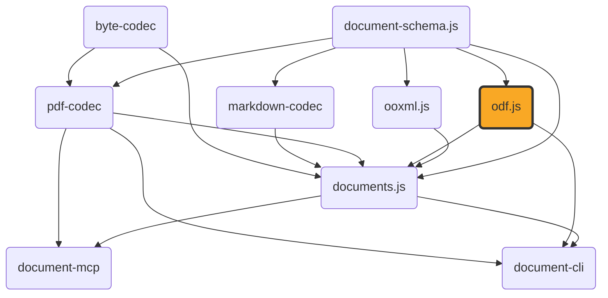

# odf.js

[](https://github.com/ExaDev/odf.js) [](https://www.npmjs.com/package/odf.js) [](https://github.com/ExaDev/odf.js/releases/latest) [](https://github.com/ExaDev/odf.js/actions)

> A hand-written, dependency-minimal codec for the OpenDocument Format (ODF — OASIS/ISO 26300): `.odt`/`.ods`/`.odp`/`.odg`/`.odf`/`.odb`/`.odm` and their template variants, built on [Zod 4](https://zod.dev) codecs.

`odf.js` is the ODF sibling of [`ooxml.js`](https://github.com/ExaDev/ooxml.js), mirroring its architecture: a lossless ZIP-of-XML core that round-trips any package byte-for-content-faithful, with typed readers layered on top. Two ODF-specific differences shape the design: ODF has no relationship mechanism (inter-part references are direct paths, with an exhaustive `META-INF/manifest.xml`), and ODF has no inline/direct formatting — every formatting difference must be a named "automatic style," so `odf.js` owns a style-interning subsystem (`src/styles/`) with no OOXML equivalent.

**This package does not depend on `ooxml.js`.** `ooxml.js`'s branding and SBOM are scoped to ECMA-376/OOXML; depending on it would be the wrong signal for an OASIS-standard codec and would force a breaking `ooxml.js` release for every ODF-only fix. The small generic ZIP/XML/`Package` layer is duplicated, kept structurally identical so TypeScript's structural typing makes both packages' values interchangeable for a shared consumer like `documents.js`. Both depend on [`document-schema.js`](https://github.com/ExaDev/document-schema.js) for the genuinely identical `ContentDocument`/`LayoutDocument` content model.



## Status

Under active development. Built and shipped:

- **Lossless core** — ZIP-of-XML primitives (`Package`/`XmlNode`/`XmlElement`, XML parse/build, zip/unzip, base64, the `packageCodec`/`xmlCodec` `z.codec()` pairs).
- **Namespaces, media types, mimetype, manifest** (`src/ns.ts`, `src/media-type.ts`, `src/mimetype.ts`, `src/manifest.ts`) — full read and write, including `META-INF/manifest.xml` and the mimetype part's mandatory first-entry/stored/uncompressed layout.
- **Style interning** (`src/styles/`) — `StyleRegistry` adopts existing automatic styles, finds-or-mints on `intern()`, fingerprints on canonical serialized properties (never `JSON.stringify`), collision-checked across all four style containers.
- **Shared typed primitives** (`src/typed/shared/`) — unit parsing, A1 cell-reference computation with repeat-count cursor advancement, colour/geometry/master-page parsing into `document-schema.js` types, whitespace-run decoding, the read-side style cascade, shared `readOdfParagraph`/`readOdfTable`, the `draw:transform`/`draw:g` group-flattening geometry resolver, an `svg:d`/`draw:points` path parser, and `meta.xml` reading.
- **Typed readers** — `readOdt` (wordprocessing), `readOdp` (presentation), `readOdg` (drawing: vector primitives in `draw:z-index`-aware paint order), and `readOds` (spreadsheet: every `office:value-type`, cell/page-anchored images, and embedded sub-documents) each resolve a `Package` into `document-schema.js`'s own `ContentSection`/`ContentSlide`/`ContentDrawPage`/`ContentSheet` shapes.
- **`readOdfFormula`** — resolves a standalone/embedded `.odf` formula's bare-MathML `content.xml` into raw MathML nodes plus a StarMath annotation. **`readOdfFormulaDocument`** wraps that into a real `'formula'`-kind `ContentDocument`.
- **`readOdm`** — resolves a `.odm` master document into an ordered list of chapter references (`{ name, href, filterName? }`); chapters are genuinely external `.odt` files by ODF design, never cached.
- **`readOdbInventory`** — resolves a `.odb` into connection info, table names, query definitions (`{ name, command, escapeProcessing? }` with real SQL text), and form/report `{ name, href }` pairs. A sub-document directory is named after an opaque *persistent* name (`forms/Obj11`), not the user-visible name.
- **`readOdbForm`/`readOdbReport`** — extract one sub-document's *static structure*, executing nothing: a form's control tree and data bindings, or a report's band stack, recursive group tree, bound fields, and computed expressions.

Not yet built: live-view editors and the `.odb` database-table-export subsystem. A general-purpose SQL query engine for rendering a Report against its data is **deliberately not attempted** — building even a bounded SQL engine means reimplementing HSQLDB's/Firebird's query semantics, a materially different undertaking from decoding their file formats, with unreviewed licensing questions. Gated on the requesting engineer's explicit sign-off.

## Getting started

Requires Node.js `>=20` and pnpm `11.6.0` (pinned via `packageManager` in `package.json`).

```sh
pnpm install
```

Install as a dependency in another project:

```sh
pnpm add odf.js
# or
npm install odf.js
```

## Build, test, and lint

```sh
pnpm build         # turbo run _build -> tsdown (dist/: ESM + CJS + .d.ts)
pnpm typecheck     # turbo run _typecheck -> tsc -p tsconfig.json && tsc -p tsconfig.node.json
pnpm lint          # turbo run _lint -> eslint . --fix --cache --max-warnings 0
pnpm test          # turbo run _test -> vitest run --project unit
pnpm test:workers  # turbo run _test:workers -> vitest run --config vitest.workers.config.ts (the package parsing and ODF content readers run inside a real Cloudflare Workers isolate, proving they carry zero Node-only API usage)
```

To run a single test file: `pnpm vitest run src/path/to/file.test.ts`.

## Usage

The lossless core — the only public surface stable enough to document with real examples right now:

```ts
import { decodePackage, encodePackage } from 'odf.js';

// .odt / .ods / .odp bytes -> faithful JSON Package
const pkg = decodePackage(new Uint8Array(await file.arrayBuffer()));

// ...inspect pkg.parts...

// Package -> bytes (content-identical, mimetype-first/stored, manifest untouched)
const bytes = encodePackage(pkg);
```

Manifest and mimetype, ODF's own package-identity mechanism (no relationships, unlike OOXML):

```ts
import { readManifest, syncManifest, setDocumentMediaType, readMimetype } from 'odf.js';

const manifest = readManifest(pkg); // { entries: [{ fullPath, mediaType }, ...] }
setDocumentMediaType(pkg, 'application/vnd.oasis.opendocument.text'); // updates mimetype + manifest root entry atomically
syncManifest(pkg); // rebuilds manifest.xml to exactly match pkg's current parts
readMimetype(pkg); // 'application/vnd.oasis.opendocument.text'
```

Every module is also importable directly by its own subpath, without going through the barrel:

```ts
import { parseOdfLength } from 'odf.js/typed/shared/units';

parseOdfLength('2.5cm'); // 70.86614173228347
```

Any `src/**/*.ts` module (excluding tests and `test-support/` fixtures) resolves at its path relative to `src/` — `src/manifest.ts` as `odf.js/manifest`, `src/typed/odt/read.ts` as `odf.js/typed/odt/read`, and so on.

## Architecture

Layered from a lossless core outward, mirroring `ooxml.js`:

- **`src/model/`** — `Package`/`XmlNode`/`XmlElement`: a duplicate-by-design copy of `ooxml.js`'s equivalent.
- **`src/xml/`** — XML parse/build (`fast-xml-parser`), production element/text-node construction, entity encoding, and tree-query helpers.
- **`src/image/`** — `sniffImageFormat`: a PNG/JPEG magic-byte sniffer consumed by `src/manifest.ts` and `src/typed/draw/shapes.ts`.
- **`src/zip.ts`** — takes *ordered* `[path, entry]` tuples, not a `Record`, so the mimetype-first/stored/uncompressed requirement doesn't depend on insertion order surviving a Zod round trip.
- **`src/package-io/`** — `write.ts` hoists `mimetype` first (stored) and `META-INF/manifest.xml` second if present; never fabricates either as a side effect.
- **`src/manifest.ts`** — full manifest read/write; the manifest is ODF's one mandatory part, unlike `ooxml.js`'s read-only OPC-relationship stance.
- **`src/styles/`** — `properties.ts`/`serialize.ts` (canonical property-bag ↔ XML attributes), `registry.ts` (`StyleRegistry`, the mandatory style-interning layer), `span.ts` (character-range `text:span` wrapping).
- **`src/typed/shared/`** — ODF-specific typed primitives every reader builds on (units, A1 cursors, colour/geometry, whitespace runs, style cascade, shared paragraph/table readers, transform/path parsing, metadata).
- **`src/typed/odt/`, `odp/`, `odg/`, `ods/`** — the `readOdt`/`readOdp`/`readOdg`/`readOds` readers.
- **`src/typed/draw/`** — the shared `draw:frame`/`draw:g`/vector shape vocabulary (`shapes.ts`), plus `embedded.ts` (`readDrawObjectReference`, `readDrawImageBlock`).
- **`src/typed/formula/`, `odm/`** — `readOdfFormula`/`readOdfFormulaDocument` and `readOdm`.
- **`src/typed/odb/`** — `readOdbInventory`, `readOdbForm`/`readOdbReport`, `resolveOdbComponent`, `subDocumentPackage`.

## Conventions

- **Zod-first schema/type/guard**, matching `ooxml.js`/`document-schema.js`: every model type is inferred from its Zod schema, never hand-written.
- **Recursive types use a hand-written structural guard, not `z.lazy`** (collapses to `unknown` in the pinned Zod version).
- **No type assertions anywhere** — `assertionStyle: 'never'`, `noInlineConfig: true`.
- **Ground truth over memory for every ODF spec fact** — namespace URIs, media types, and attribute names are verified against the OASIS spec or real LibreOffice output, never assumed from an OOXML analogue (see [Gotchas](#gotchas-and-quirks)).

## Gotchas and quirks

- **Several ODF namespace URIs are not what you'd guess from the prefix.** `draw:` is `...drawing:1.0`, `number:` is `...datastyle:1.0`, `fo:`/`svg:`/`smil:` are `*-compatible:1.0`. See `src/ns.ts`.
- **`.odb`'s media type is `application/vnd.oasis.opendocument.base`**, not `...database`.
- **`dc:creator` records whoever most recently *saved* the document, not the author** — the original author is `meta:initial-creator`.
- **`meta:keyword` appears once per keyword**, unlike OOXML's single comma-separated `cp:keywords`.
- **`table:number-columns-repeated`/`-rows-repeated` must be cursor-advanced, never materialized** — real sheets have trailing repeat counts over a million.
- **ODF cells carry no explicit cell-reference attribute** (unlike xlsx's `r="B7"`) — `typed/shared/a1.ts` computes references from a running cursor.
- **A rotated `draw:rect`/`ellipse`/`path`/`custom-shape` reads its own `rotationDeg`** via the same `resolveOdfShapeGeometry` machinery `draw:frame` uses, composing any enclosing `draw:g` rotation.
- **Every `ContentShape`/`ContentVector` carries a resolved `paintOrder`** so true relative paint order survives across the independently-ordered `shapes`/`vectors` arrays.
- **`svg:fill-rule` and `draw:stroke` map onto `ContentVector.fillRule`/`ContentStroke.style`.** A dotted pattern and `"double"` stroke have no ODF vector-stroke counterpart and remain unread.
- **`readOds`/`readTableCell` resolve cell `background`/`borders`/`alignment`/`verticalAlignment` from the real style cascade.** An explicit `fo:border-*` of `"none"`/`"hidden"` clears an inherited edge.
- **`readOds` reads sheet-anchored drawings** — cell-anchored `draw:frame`s (coordinates relative to the cell) and page-anchored ones (in `table:shapes`). A sheet cannot carry a floating text box, bare vector, or embedded chart; each is skipped.
- **`readDrawObjectReference` resolves a frame's embedded sub-document kind from its own `content.xml`, not the manifest.** A `draw:object` must be checked *before* the frame's preview image, since an embedded-object frame also carries a preview `draw:image`.
- **An embedded Math object in a spreadsheet cell reads as `objectKind: 'formula'`** — its `content.xml` root *is* the MathML root, so `readDrawObjectReference` falls back to `findMathRoot` and dispatches to `readOdfFormulaDocument`.
- **A `draw:frame`'s alternative text (`svg:title`, falling back to `svg:desc`) reads into `ContentImageBlock.altText`.**
- **`readOdbInventory`'s `queries` carry real `db:command` SQL text**, not just names — a breaking rename from `string[]` to `OdbQueryInfo[]`.
- **`.odb` Form/Report structure extraction is real** (`readOdbForm`/`readOdbReport`), grounded in a genuine fixture. **A SQL/`rpt:` rendering engine to execute a query or evaluate report totals is deliberately not attempted** — see the Status section. Even a fully bounded SQL engine would not suffice to render a report: grouping breaks (`rpt:HASCHANGED`), prefix functions (`rpt:LEFT`), and running totals (`rpt:SUM`) are evaluated by Report Builder's own `rpt:` formula language, not by SQL.

## Release and publishing

`.github/workflows/ci.yml` runs commitlint, lint, typecheck, unit, and smoke tests on every push/PR. On a push to `main` where all pass, `release.config.ts` drives [semantic-release](https://semantic-release.gitbook.io/semantic-release): version bump from commit history, `CHANGELOG.md`/`package.json` committed back, GitHub Release cut, and npm publish via OIDC trusted publishing (no `NPM_TOKEN`). Once a release publishes (detected by diffing `package.json`'s version): a `sibling-released` event dispatches to `documents.js`/`document-cli`, the build republishes under `@exadev/odf.js` to GitHub Packages, and an SPDX SBOM plus build-provenance attestation are signed against the tarball.

## Contributing

Conventional Commits (`feat:`, `fix:`, `test:`, `chore:`, …), enforced by commitlint via a husky `commit-msg` hook and a CI job. A `pre-commit` hook runs `lint-staged` (`eslint --fix` on staged `*.ts`); `pre-push` runs the test suite. Single `main` branch, no open PR workflow.

## References

- [ooxml.js](https://github.com/ExaDev/ooxml.js) — the OOXML sibling; architecturally mirrored, deliberately not depended on.
- [document-schema.js](https://github.com/ExaDev/document-schema.js) — the canonical `ContentDocument`/`LayoutDocument` schema both packages depend on.
- [documents.js](https://github.com/ExaDev/documents.js) — the downstream consumer; its `readOdtContent`/`readOdpContent`/`readOdsContent`/`readOdgContent` are thin adapters over this package's readers.

## License

MIT
