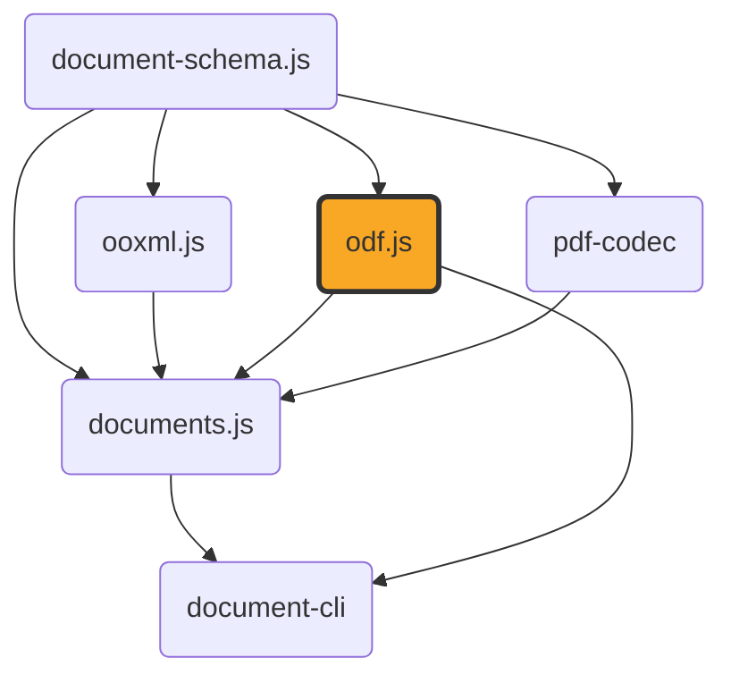

# odf.js

[](https://github.com/ExaDev/odf.js) [](https://www.npmjs.com/package/odf.js) [](https://github.com/ExaDev/odf.js/releases/latest) [](https://github.com/ExaDev/odf.js/actions)

> A hand-written, dependency-minimal codec for the OpenDocument Format (ODF — OASIS/ISO 26300): `.odt`/`.ods`/`.odp`/`.odg`/`.odf`/`.odb`/`.odm` and their template variants, built on [Zod 4](https://zod.dev) codecs.

`odf.js` is the ODF sibling of [`ooxml.js`](https://github.com/ExaDev/ooxml.js), mirroring its architecture as closely as the two, structurally unrelated formats allow: a lossless ZIP-of-XML core that round-trips any package byte-for-content-faithful, with ergonomic typed readers layered on top for convenient access. Unlike OOXML — a ZIP of parts with a relationship-file (`.rels`) mechanism and an extension-defaults-plus-overrides `[Content_Types].xml` — ODF has no relationships at all (inter-part references are direct paths/IRIs) and an exhaustive `META-INF/manifest.xml` that enumerates every part explicitly. Where OOXML runs carry formatting directly as attributes, ODF has no inline/direct formatting whatsoever: every formatting difference, however small, must be a named "automatic style" — so `odf.js` owns a style-interning subsystem (`src/styles/`) with no equivalent anywhere in `ooxml.js`.

**This package does not depend on `ooxml.js`**, even though the two do near-identical jobs for their respective formats: `ooxml.js` is a package signed, SBOM-attested, and branded exclusively around ECMA-376/OOXML, so depending on it here would be a permanently wrong signal for an OASIS-standard codec, and would force a breaking `ooxml.js` release every time an ODF-only fix needed the shared primitive layer. Instead, `odf.js` duplicates the small (~400-line) generic ZIP/XML/`Package` layer as its own code — kept deliberately structurally identical (plain, unmarked shapes, no branding) so TypeScript's structural typing makes the two packages' `Package`/`XmlNode`/`XmlElement` values freely interchangeable wherever a shared consumer (like `documents.js`) needs to treat them uniformly, without either package formally depending on the other.

Both packages **do** depend on [`document-schema.js`](https://github.com/ExaDev/document-schema.js), the genuinely shared canonical schema for `ContentDocument`/`LayoutDocument` — the semantic content model (paragraphs, runs, tables, shapes, slides) both an ODF and an OOXML reader ultimately produce. `odf.js`'s typed readers return the real, imported `ContentSection`/`ContentSlide`/etc. types from that package, not a structurally-similar lookalike, so a downstream consumer (`documents.js`) can run an `.odt` through the exact same layout/pagination engine it already uses for `.docx`, unmodified.



## Status

This package is under active development. What's built and shipped:

- **Lossless core** — generic ZIP-of-XML primitives (`Package`/`XmlNode`/`XmlElement`, XML parse/build, zip/unzip, base64, the `packageCodec`/`xmlCodec` `z.codec()` pairs) with zero ODF-specific knowledge.
- **Namespaces, media types, mimetype, manifest** (`src/ns.ts`, `src/media-type.ts`, `src/mimetype.ts`, `src/manifest.ts`) — full read *and* write, including `META-INF/manifest.xml`'s exhaustive per-part enumeration and the mimetype part's mandatory first-entry/stored/uncompressed byte layout, verified against real LibreOffice-produced output.
- **Style interning** (`src/styles/`) — `StyleRegistry`: adopts a part's existing automatic styles on construction, finds-or-mints on `intern()`, fingerprints on canonical serialized properties plus parent style name (never `JSON.stringify`), and is collision-checked across all four style containers a document can have.
- **Shared typed primitives** (`src/typed/shared/`) — ODF length-unit parsing (`cm`/`mm`/`in`/`pt`/`pc`/`px`), A1-style spreadsheet cell-reference computation with repeat-count cursor advancement, colour/geometry/master-page-size parsing into `document-schema.js`'s own types, ODF's `text:s`/`text:tab`/`text:line-break` whitespace-run decoding, the read-side style cascade (`style:default-style` → parent chain → the referenced style — one layer shorter than OOXML's, since ODF has no separate direct-formatting layer on top), the shared `text:p` → `ContentParagraph`/`ContentRun` and `table:table` → `ContentTable` readers (`readOdfParagraph`/`readOdfTable`) every typed reader below builds on, the `draw:transform`/`draw:g` group-flattening geometry resolver, an `svg:d`/`draw:points` vector-path grammar parser, and `meta.xml` reading.
- **Typed readers** — `readOdt` (wordprocessing), `readOdp` (presentation slides: `draw:frame`/`draw:g` text/image/table content), `readOdg` (drawing pages: every vector primitive — `draw:rect`/`draw:ellipse`/`draw:circle`/`draw:line`/`draw:path`/`draw:polygon`/`draw:polyline`, plus a recognised `draw:custom-shape` preset subset — in real `draw:z-index`-aware paint order), and `readOds` (spreadsheets: geometry- and print-settings-rich, every `office:value-type` variant with its own OpenFormula string) each resolve a `Package` into `document-schema.js`'s own `ContentSection`/`ContentSlide`/`ContentDrawPage`/`ContentSheet` shapes.
- **`readOdfFormula`** resolves a standalone or embedded `.odf` formula's `content.xml` — bare MathML with no `office:document-content` wrapper, confirmed against real LibreOffice output — into its raw MathML nodes plus, when present, the formula's own native StarMath annotation string. There is no `document-schema.js` pivot type for MathML, so this reader's own output type is its own.
- **`readOdm`** resolves a `.odm` master document's own `content.xml` into an ordered list of chapter references (`{ name, href, filterName? }`, one per top-level linked `text:section`) without opening the external `.odt` files those references point at. A master document's chapters are genuinely external files by ODF design, not embedded package sub-documents — confirmed against real LibreOffice output, which never caches a chapter's own content inside the master document itself (see `src/typed/odm/read.ts`'s own top-of-file note).
- **`readOdbInventory`** resolves a `.odb` database front-end package into connection info plus the *names* of its forms/queries/reports/tables — never their content, and never the embedded/external database engine's own binary or script storage. Confirmed against real LibreOffice output that `office:database` lives directly in the package's ordinary `content.xml` (no separate `database/connection.xml` part, contrary to the OASIS schema's own chapter layout suggesting one), that queries are named inline (`db:queries/db:query`, no manifest part of their own), and that a live engine's own tables have no ODF-level manifest listing at all — only forms/reports genuinely are separate manifest sub-document parts (`forms/<Name>/content.xml`, `reports/<Name>/content.xml`). See `src/typed/odb/read.ts`'s own top-of-file note for the full findings.

Not yet built: live-view editors and the `.odb` database-table-export subsystem. This section will be replaced with real usage examples once those land — see the [Architecture](#architecture) section below for the intended shape, and this repository's own commit history/releases for current progress.

## Getting started

Requires Node.js `>=20` and pnpm `11.6.0` (pinned via `packageManager` in `package.json`).

```sh
pnpm install
```

Install as a dependency in another project:

```sh
pnpm add odf.js
# or
npm install odf.js
```

## Usage

The lossless core — the only public surface stable enough to document with real examples right now:

```ts
import { decodePackage, encodePackage } from 'odf.js';

// .odt / .ods / .odp bytes -> faithful JSON Package
const pkg = decodePackage(new Uint8Array(await file.arrayBuffer()));

// ...inspect pkg.parts...

// Package -> bytes (content-identical, mimetype-first/stored, manifest untouched)
const bytes = encodePackage(pkg);
```

Manifest and mimetype, ODF's own package-identity mechanism (no relationships, unlike OOXML):

```ts
import { readManifest, syncManifest, setDocumentMediaType, readMimetype } from 'odf.js';

const manifest = readManifest(pkg); // { entries: [{ fullPath, mediaType }, ...] }
setDocumentMediaType(pkg, 'application/vnd.oasis.opendocument.text'); // updates mimetype + manifest root entry atomically
syncManifest(pkg); // rebuilds manifest.xml to exactly match pkg's current parts
readMimetype(pkg); // 'application/vnd.oasis.opendocument.text'
```

Every module is also importable directly by its own subpath, without going through the barrel — useful for a caller that wants one narrow piece of the package (e.g. a bundler doing tree-shaking, or a script that only needs the length-unit parser) without pulling in the rest:

```ts
import { parseOdfLength } from 'odf.js/typed/shared/units';

parseOdfLength('2.5cm'); // 70.86614173228347
```

Any `src/**/*.ts` module (excluding tests and internal `test-support/` fixtures) resolves this way, at its path relative to `src/` — `src/manifest.ts` as `odf.js/manifest`, `src/typed/odt/read.ts` as `odf.js/typed/odt/read`, and so on.

## Architecture

Layered from a lossless core outward, mirroring `ooxml.js`'s own structure:

- **`src/model/`** — `Package`/`XmlNode`/`XmlElement` and friends: a duplicate-by-design copy of `ooxml.js`'s equivalent, kept structurally identical (see [Why no `ooxml.js` dependency](#why-no-ooxmljs-dependency) above).
- **`src/xml/`** — `parse.ts`/`build.ts` (XML string ⇄ `XmlNode[]` forest via `fast-xml-parser`), `fragment.ts`/`entities.ts` (production element/text-node construction and entity encoding — `odf.js` writes `manifest.xml` itself, unlike `ooxml.js`'s read-only stance on OPC relationships, so this needs to be real writing code, not test-only scaffolding), `query.ts` (shared tree-query helpers).
- **`src/image/`** — `sniffImageFormat` (`ImageFormat`): a minimal PNG/JPEG magic-byte format sniffer with no ODF knowledge of its own, consumed by `src/manifest.ts` (choosing a binary part's manifest media type) and `src/typed/draw/shapes.ts` (resolving a `draw:image`'s own `ContentImageBlock.format`).
- **`src/zip.ts`** — takes *ordered* `[path, entry]` tuples, not a `Record`, specifically so ODF's mimetype-first/stored/uncompressed requirement doesn't depend on `Record`/`Object.keys` insertion order surviving a Zod round trip.
- **`src/package-io/`** — `write.ts` hoists a `mimetype` part first (stored) and `META-INF/manifest.xml` second, if present, before everything else in existing order — the one deliberate behavioural difference from `ooxml.js`'s own writer, and never fabricates either part as a side effect.
- **`src/manifest.ts`** — unlike `ooxml.js` (which only ever *reads* OPC relationships, leaving writing to `documents.js`), `odf.js` owns manifest read **and** write, since the manifest is ODF's one mandatory part and its correctness is exhaustive.
- **`src/styles/`** — `properties.ts` (the property-bag shape + real ODF attribute parsing), `serialize.ts` (canonical, deterministic property-bag → XML attributes), `registry.ts` (`StyleRegistry`, ODF's mandatory style-interning layer, no OOXML equivalent), `span.ts` (character-range wrapping into a formattable `text:span`, correctly splitting `text:s`/`text:tab` elements that straddle a boundary).
- **`src/typed/shared/`** — the ODF-specific typed primitives every future format reader builds on: `units.ts`, `a1.ts`, `color.ts`/`geometry.ts` (parsing into `document-schema.js`'s own types, never redefining them), `style.ts` (a thin re-export — ODF's style-properties concern is fully covered by `styles/properties.ts` and the cascade below), `text.ts` (whitespace-run decoding), `cascade.ts` (the read-side style-resolution walk), `paragraph.ts`/`table.ts` (`readOdfParagraph`/`readOdfTable`, the shared `text:p` → `ContentParagraph`/`ContentRun` and `table:table` → `ContentTable` readers `readOdt`, `readOds`, and `typed/draw/shapes.ts` all call), `transform.ts` (the `draw:transform`/`draw:g` group-flattening geometry resolver), `masterpage.ts` (master-page → page-layout page-size/print-settings resolution, shared by a `draw:page`'s own size and a spreadsheet's print settings), `path.ts` (an `svg:d`/`draw:points` vector-path grammar parser), `metadata.ts` (`meta.xml` reading).
- **`src/typed/odt/`, `src/typed/odp/`, `src/typed/odg/`, `src/typed/ods/`** — the built `readOdt`/`readOdp`/`readOdg`/`readOds` readers; **`src/typed/draw/`** — the `draw:frame`/`draw:g`/vector-primitive shape vocabulary `readOdp` and `readOdg` both share; **`src/typed/formula/`, `src/typed/odm/`** — `readOdfFormula` (raw MathML, no `document-schema.js` pivot) and `readOdm` (a `.odm` master document's own external chapter references — name/href/filter-name per linked `text:section`, never the linked content itself); **`src/typed/odb/`** — `readOdbInventory` (a `.odb` package's own connection info plus form/query/report/table *names*, never their content or the database engine's own storage).

## Why no `ooxml.js` dependency

See the top of this README — the short version: `ooxml.js`'s branding and signed SBOM make it the wrong dependency for an OASIS-standard package regardless of how much low-level code the two could share; `document-schema.js` is the neutral package both actually depend on for the parts that are genuinely, permanently identical (the semantic content vocabulary), while the ZIP-of-XML primitive layer stays duplicated on purpose.

## Conventions

- **Zod-first schema/type/guard**, matching `ooxml.js`/`document-schema.js`: every model type is inferred from its Zod schema, never hand-written.
- **Recursive types use a hand-written structural guard, not `z.lazy`** — the same `z.lazy`-collapses-to-`unknown` issue `ooxml.js`'s `XmlNode` and `document-schema.js`'s `ContentBlock` already work around.
- **No type assertions anywhere** — `assertionStyle: 'never'`, `noInlineConfig: true`, matching both sibling packages exactly.
- **Ground truth over memory for every ODF spec fact.** Namespace URIs, media types, style-property attribute names, and `meta.xml` element names are all verified against either the live OASIS ODF specification or real files produced by an installed LibreOffice, never assumed from pattern-matching an OOXML analogue or a remembered convention — several confirmed traps exist specifically because the "obvious" guess is wrong (see [Gotchas](#gotchas-and-quirks)).

## Gotchas and quirks

- **Several ODF namespace URIs are not what you'd guess from the prefix.** `draw:` is `...xmlns:drawing:1.0`, not `...draw:1.0`; `number:` is `...xmlns:datastyle:1.0`, not `...number:1.0`; `fo:`/`svg:`/`smil:` are OASIS's own `*-compatible:1.0` URIs, not the real W3C namespaces those prefixes suggest. See `src/ns.ts`'s inline comments for the full, verified table.
- **`.odb`'s real media type is `application/vnd.oasis.opendocument.base`**, not `...database` — a common stale/wrong value found in some third-party documentation.
- **ODF's `dc:creator` is not "the author."** It records whoever most recently *saved* the document (Dublin Core's own definition); the original author is `meta:initial-creator`. `typed/shared/metadata.ts` maps `LayoutMetadata.author` to `meta:initial-creator`, matching the byline role `ooxml.js`'s own `DocumentMetadata.author` plays for OOXML.
- **`meta:keyword` appears once per keyword**, unlike OOXML's single comma-separated `cp:keywords` element.
- **`table:number-columns-repeated`/`table:number-rows-repeated` must be cursor-advanced, never materialized.** A real spreadsheet has trailing cells/rows with repeat counts over a million; `typed/shared/a1.ts`'s cursor advances in O(1) without allocating that many objects — tested against a real repeat count taken from a genuine LibreOffice template.
- **ODF cells carry no explicit cell-reference attribute at all** (unlike xlsx's `r="B7"`) — `typed/shared/a1.ts` computes A1-style references from a running column/row cursor as a reader walks cells in document order.

## Release and publishing

`.github/workflows/ci.yml` runs commitlint, lint, typecheck, the unit suite, and the smoke test on every push and pull request. On a push to `main` where those all pass, `release.config.ts` drives [semantic-release](https://semantic-release.gitbook.io/semantic-release): commit history since the last tag decides the version bump, `CHANGELOG.md` and `package.json` are committed back to `main`, a GitHub Release is cut, and the package publishes to [npmjs.org](https://www.npmjs.com/package/odf.js) — via npm's OIDC trusted publishing, so no `NPM_TOKEN` exists anywhere in the pipeline. A further job republishes the same build under the scoped `@exadev/odf.js` alias to GitHub Packages, and another signs an SPDX SBOM and build-provenance attestation against the exact release tarball.

## Contributing

Commits follow Conventional Commits (`feat:`, `fix:`, `test:`, `chore:`, …), enforced by commitlint via a husky `commit-msg` hook and a CI `commitlint` job. A husky `pre-commit` hook runs `lint-staged` (`eslint --fix` on staged `*.ts` files) and `pre-push` runs the test suite. There is a single `main` branch and no open pull request workflow established so far.

## References

- [ooxml.js](https://github.com/ExaDev/ooxml.js) — the sibling package doing the equivalent lossless-codec job for OOXML (docx/pptx/xlsx). Architecturally mirrored, deliberately not depended on — see [Why no `ooxml.js` dependency](#why-no-ooxmljs-dependency).
- [document-schema.js](https://github.com/ExaDev/document-schema.js) — the canonical `ContentDocument`/`LayoutDocument` schema pivot both this package and `ooxml.js` depend on.
- [documents.js](https://github.com/ExaDev/documents.js) — the downstream consumer, already built on this package's typed readers: its own `readOdtContent`/`readOdpContent`/`readOdsContent`/`readOdgContent` are thin adapters over `readOdt`/`readOdp`/`readOds`/`readOdg`, feeding both ODF ⇄ PDF conversion (`odtToPdf`/`odpToPdf`/`odsToPdf`/`odgToPdf` and their inverses) and independently-built live-view ODF editors (`OdtEditor`/`OdpEditor`/`OdsEditor`/`OdgEditor`).

## License

MIT
